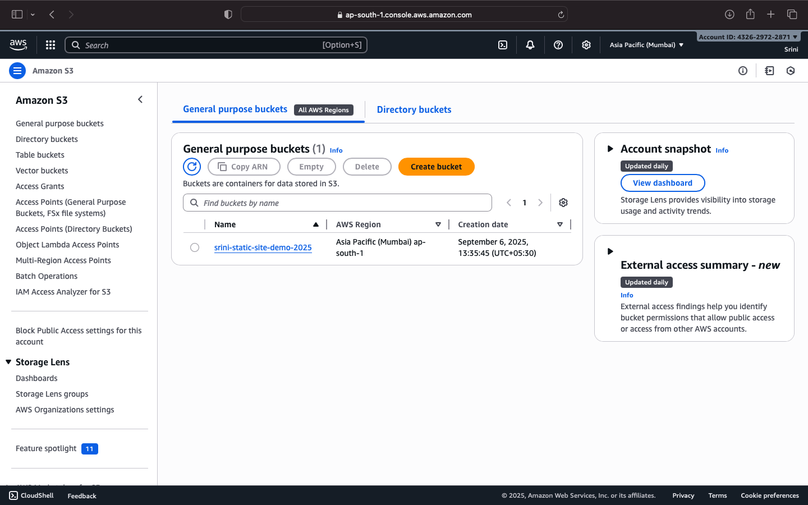
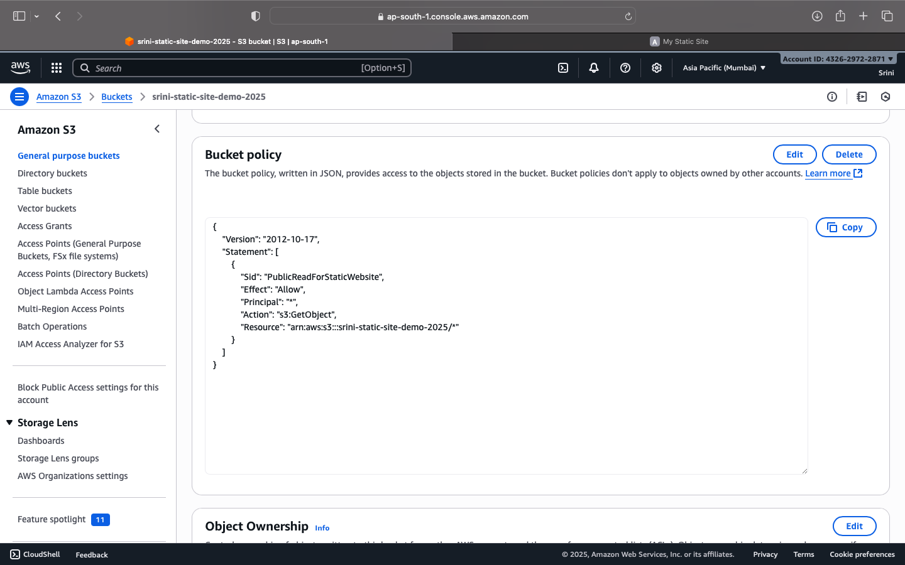

# 🌐 AWS Static Website Hosting 
## 📌 Project Overview
This project demonstrates how to host a **static website** on **Amazon S3** with public access, ensuring high availability and cost-effectiveness.

## 🔧 Tools & Services
- Amazon S3
- AWS Management Console
- Browser (for testing)

## 🚀 Implementation Steps
1. Created & configured S3 bucket
2. Enabled static website hosting
3. Applied bucket policy for public access
4. Uploaded HTML, CSS, and JS files
5. Verified live website functionality

## 📸 Project Output

### 1. AWS S3 Bucket Setup

### 2. Bucket Policy Configuration

### 3. Static Website Hosted Successfully

## 🌟 Outcome
A fully functional static website hosted on AWS S3.  

---

## 🙌 Acknowledgement
This project was completed as part of my internship with **Pinnacle**.  
